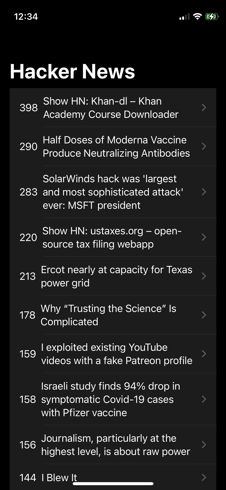
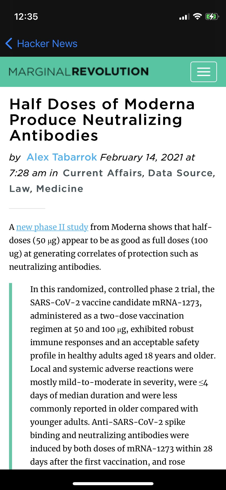

# 📰 hacker-news 

App that shows topics and its upvotes from algolia API, also allows to read them directly in the app.  

**This app uses:** 
-Observer Design Pattern 
-SwiftUI 
-Combine 
-Git 

**Screenshots:** 
 
